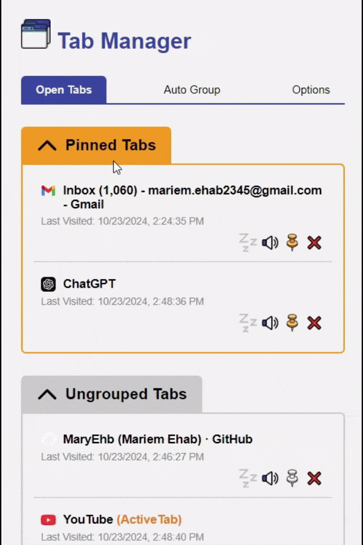

    
# Tab Manager Chrome Extension
A Chrome extension to efficiently manage and organize your browser tabs, helping you stay focused, reduce memory usage, and keep track of your open tabs.

## Table of Contents
- [Overview](#overview)
- [Demo Video](#demo-video)
- [Installation](#installation)
- [What is a Chrome Extension?](#what-is-a-chrome-extension)
- [Key Features](#key-features)
- [File Structure](#file-structure)
- [Contributing](#contributing)
- [Tech Stack](#tech-stack)
- [License](#license)

## Overview
Managing too many open tabs can quickly become overwhelming, slowing down your browser and making it difficult to stay organized. **Tab Manager Extension** helps you group, mute, sleep, and restore tabs, ensuring you never lose track of your work.

## Demo Video
[Link to the demo video here](https://drive.google.com/file/d/1bEkgMOSpTxdjp2_MOajCE4XS1l_BZrmO/view?usp=drive_link)

## Installation
To install the extension locally for development or personal use:
1. Download the extension files.
2. Go to [Chrome Extensions](chrome://extensions/).
3. Enable **Developer mode** (toggle in the upper right corner).
4. Click **Load unpacked** and select the extension folder.

## What is a Chrome Extension?
Chrome extensions are small software programs that customize the browsing experience. They enable users to tailor Chrome's functionality and behavior to their individual needs or preferences. Extensions can modify the user interface, enhance web pages, or add new features.

### Major Parts of a Chrome Extension
- **Content Script**: A JavaScript file that runs in the context of web pages, allowing you to manipulate the DOM of the pages users visit. Content scripts can read and modify the content of web pages. (wasn't needed for our extension so we didn't use it)

- **Popup UI**: The user interface that appears when users click on the extension icon in the toolbar. This interface allows users to interact with the extension's features.

- **Background Script**: A background script that runs in the background and manages tasks such as listening for events, handling data, and maintaining a persistent state for the extension. Background scripts can communicate with other parts of the extension and perform actions without requiring user interaction.

- **Manifest File**: A JSON file that contains metadata about the extension, including its name, version, permissions, and other settings. The manifest file is essential for defining how the extension interacts with the browser.

## Key Features
The Extension is divided into four main tabs:



- **Open Tabs**: Displays all your open tabs, organized into pinned, ungrouped, and grouped categories. Users can click to access tabs, view the last visited time, and control options like sleep, mute, or close.
- **Auto Group**: Automatically groups tabs based on user-defined URL patterns, making it easier to manage multiple tabs.
- **Sessions**: Manage saved tab sessions, allowing users to restore groups of tabs for different tasks or projects.
- **Options**: Configure tab management preferences and features to suit your workflow.

> **Note:** The **Sessions** tab is not developed yet and currently not shown in the popup UI.

## File Structure
```
TabManagerExtension/
├── popup.html              # Main HTML file for the popup interface
├── popup.js                # Primary JavaScript for popup functionality
│   ├── openTabs.js         # Manages open tabs display and control
│   ├── autoGroup.js        # Handles auto grouping of tabs
│   ├── sessions.js         # Manages saved tab sessions
│   └── options.js          # Handles user preferences and settings
├── background.js           # Background script for event handling
├── manifest.json           # Metadata and configuration details
└── icons/                  # Folder for extension icons
```

## Contributing

We welcome contributions! Here's how you can get started:

1. **Fork** this repository.
2. **Clone** the forked repository to your local machine:
    ```bash
    git clone https://github.com/MaryEhb/tab-manager-chrome-extension.git
    ```
3. Create a new branch for your changes:
    ```bash
    git checkout -b my-new-feature
    ```
4. Make your changes and commit them:
    ```bash
    git commit -m "Add new feature"
    ```
5. Push to the branch:
    ```bash
    git push origin my-new-feature
    ```
6. Open a pull request and describe what you've changed.

### Setting Up for Development
- Load the extension as described in the [Installation](#installation) section.
- Since the project is focused on pure HTML, CSS, and JavaScript, no build steps are required, keeping it simple for beginners.

### Issues and Feature Requests
Feel free to report any issues or feature requests via the [issues page](https://github.com/MaryEhb/tab-manager-chrome-extension/issues).

## Tech Stack
- **HTML/CSS/JavaScript**: The core languages used to build this extension.
- **Chrome Extensions API**: For managing browser tabs and interacting with Chrome.

## License

This project is licensed under the MIT License - see the [LICENSE](LICENSE) file for details.
